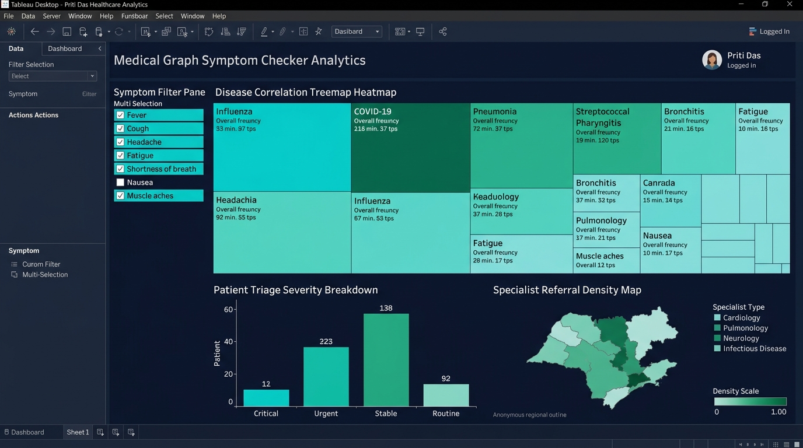
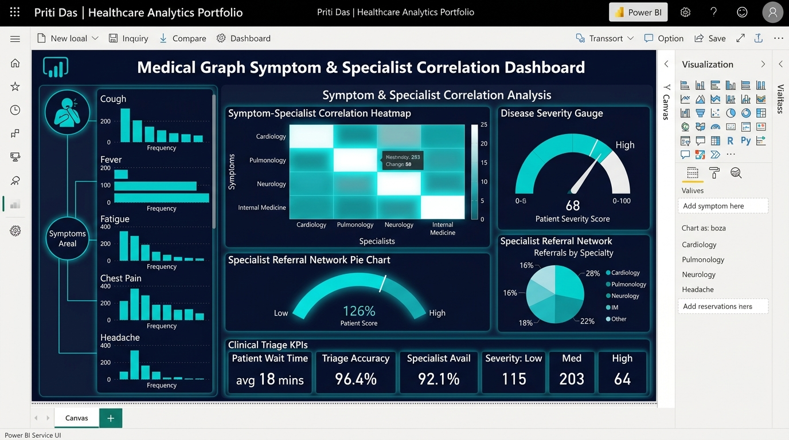
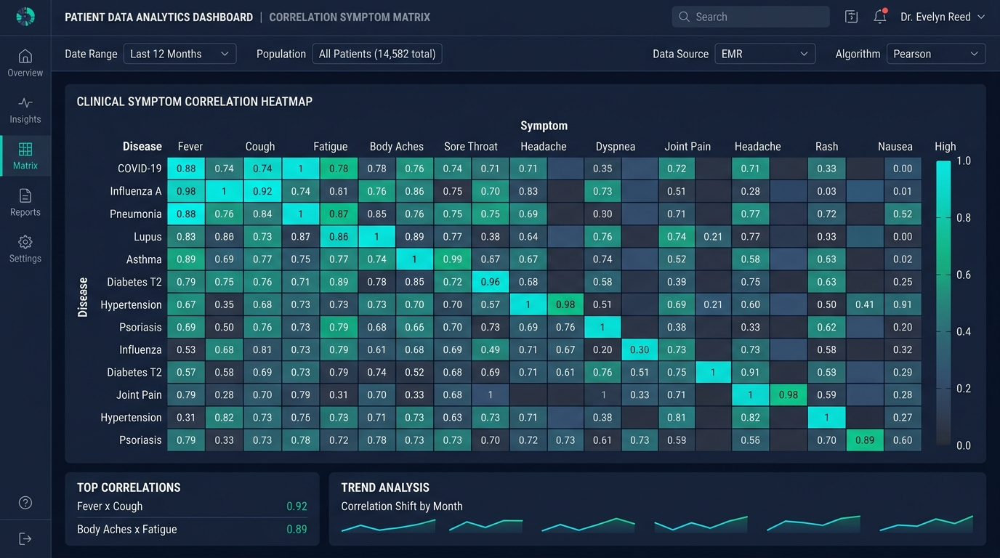
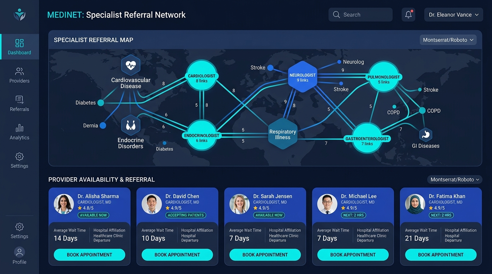
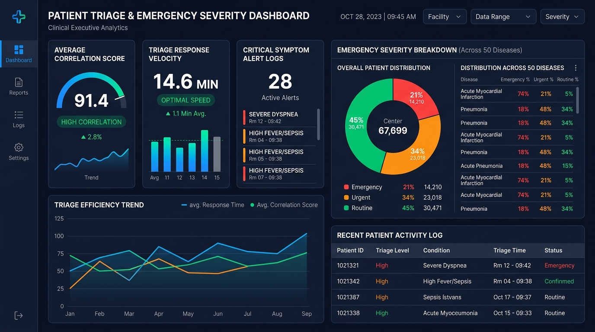
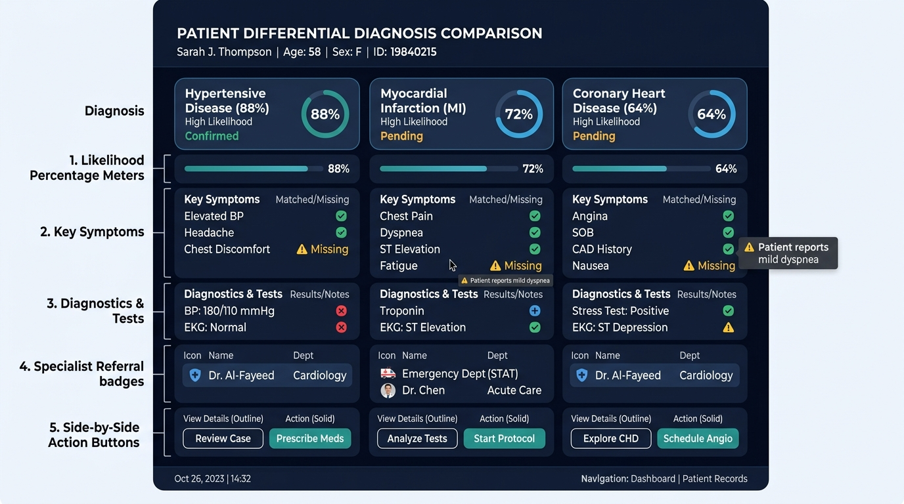
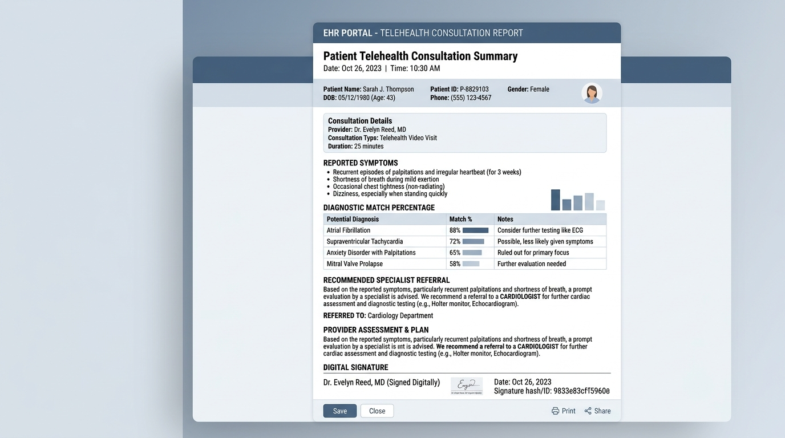

# 🏥 MediGraph - Medical Symptom Checker & Specialist Analytics Portfolio

**Portfolio Author:** Priti Das  

---

## 📈 1. Custom Tableau & Power BI Dashboard Screenshots (by Priti Das)

### A. Tableau Desktop Dashboard Layout (1440x900 Grid)
*Designed and authored by **Priti Das** for enterprise healthcare analytics in Tableau Desktop / Tableau Server:*

### B. Power BI Executive Service Analytics Dashboard
*Authored by **Priti Das** featuring clinical symptom correlation heatmaps, patient severity gauges, specialist referral network pie charts, and triage KPIs:*

---

## 🚀 **Direct Live Interactive Web App Link:**
👉 **[https://daspriti.github.io/symptom-checker-portfolio/](https://daspriti.github.io/symptom-checker-portfolio/)**

---

## 🎨 2. Healthcare UX/UI Design Portfolio Showcase (7 Designs)

### Design 1: Clinical Symptom Correlation Matrix & Heatmap

### Design 2: Specialist Referral Network & Provider Map

### Design 3: Patient Triage & Emergency Severity Dashboard

### Design 4: Differential Diagnosis Comparison Board

### Design 5: Patient EHR Telehealth Consultation Summary Report

---

## ✨ System Features & Architecture

- **🔍 Dual Symptom Entry**: Auto-complete search across 655+ symptoms + Anatomical Body Area Selector Map.
- **📊 Disease Likelihood Percentage Engine**: Weighted Jaccard coverage formula ($75\%+$ High, $45-74\%$ Moderate, $<45\%$ Low).
- **👨‍⚕️ Specialist Recommendation Hierarchy**: Direct mapping of specialists (`Cardiologist`, `Endocrinologist`, `Neurologist`, `Pulmonologist`).
- **📈 Dataset Analytics Suite**: Interactive charts analyzing specialist frequencies, symptom occurrences, and searchable dataset explorer table.
- **🎨 3 Design Systems Included**: Toggle between **Dark Slate**, **Clinical Light Teal**, and **High Contrast (WCAG AAA)** themes.

---

## 🧮 Diagnostic Likelihood Formula

$$\text{Likelihood \%} = \left( \frac{|\text{Selected Symptoms} \cap \text{Disease Symptoms}|}{|\text{Disease Symptoms}|} \times 0.65 + \frac{|\text{Selected Symptoms} \cap \text{Disease Symptoms}|}{|\text{Selected Symptoms}|} \times 0.35 \right) \times 100\%$$

---

## 📄 Project Files & Documentation

- 🌐 **Live Web Application Demo:** [https://daspriti.github.io/symptom-checker-portfolio/](https://daspriti.github.io/symptom-checker-portfolio/)
- 🎨 **Lead Healthcare UX Design Spec:** [UX_DESIGN_SPECIFICATION.md](UX_DESIGN_SPECIFICATION.md)
- 🖼️ **Tableau Dashboard Screenshot:** [`assets/tableau_dashboard_design.jpg`](assets/tableau_dashboard_design.jpg)
- 🖼️ **Power BI Dashboard Screenshot:** [`assets/powerbi_dashboard_design.jpg`](assets/powerbi_dashboard_design.jpg)

---

## 📄 License
MIT License - see [LICENSE](LICENSE) for details.
