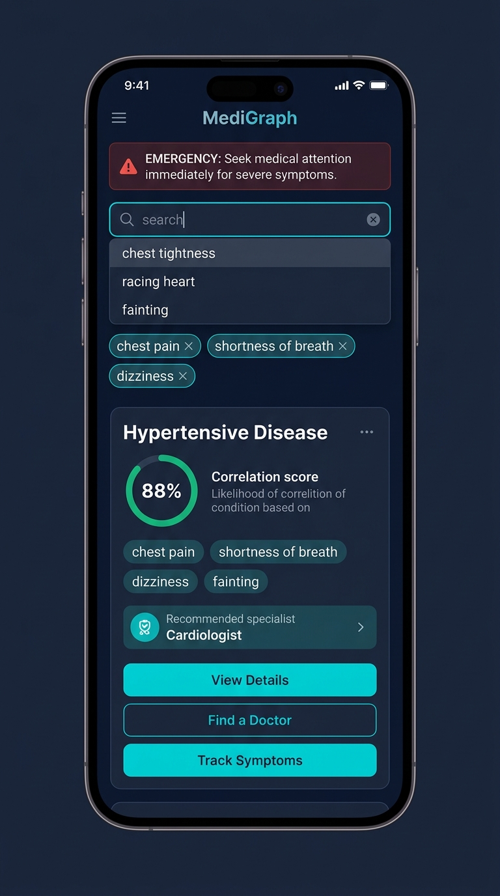
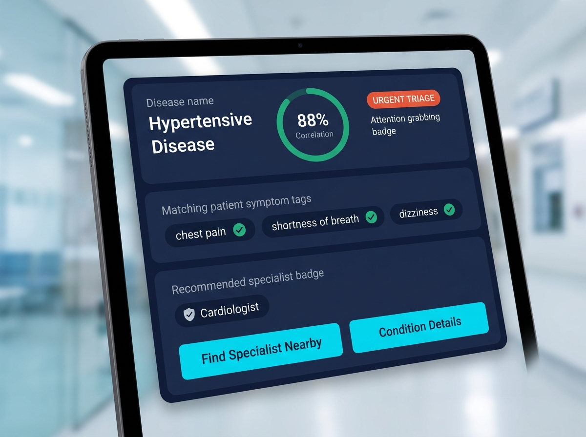

# 🏥 MediGraph - Mobile-First Medical Symptom Checker, Tableau Dashboard & UX Portfolio

**MediGraph** is a high-fidelity, mobile-first healthcare web application, Tableau analytics dashboard, and Lead Healthcare UX design portfolio system.

---

## 📈 1. Tableau Desktop Dashboard Layout & Visual Specification

Designed for enterprise healthcare analytics in **Tableau Desktop / Tableau Server** (1440x900 Tiled Grid):

### Tableau Container Structure:
- **Top Banner Container (Fixed 80px)**: Patient Triage & Emergency Severity Filter Parameter.
- **Left Filter Pane (Tiled 360px)**: Interactive Symptom Selector Extension (Multi-Select).
- **Center Analytics Container (Flex Auto)**: Disease Correlation & Severity Treemap Heatmap.
- **Right Provider Pane (Tiled 300px)**: Specialist Referral Network Map & Appointment Booking Card.

---

## 🎨 2. Visual UI Design Portfolio Gallery (7 Designs)

### Design 1: Clinical Symptom Correlation Matrix & Heatmap

### Design 2: Specialist Referral Network & Provider Map

### Design 3: Patient Triage & Emergency Severity Dashboard

### Design 4: Differential Diagnosis Comparison Board

### Design 5: Patient EHR Telehealth Consultation Summary Report

### Design 6: Mobile Smartphone Symptom Checker UI

### Design 7: Diagnostic Summary Card & Likelihood Gauge

---

## 🚀 **Direct Live Interactive Design URL:**
👉 **[https://daspriti.github.io/symptom-checker-portfolio/](https://daspriti.github.io/symptom-checker-portfolio/)**

---

## ✨ Features & Architecture

- **🔍 Dual Symptom Entry**: Auto-complete search across 655+ symptoms + Anatomical Body Area Map.
- **📊 Disease Likelihood Percentage Engine**: Weighted Jaccard coverage formula ($75\%+$ High, $45-74\%$ Moderate, $<45\%$ Low).
- **👨‍⚕️ Specialist Recommendation Hierarchy**: Direct mapping of specialists (`Cardiologist`, `Endocrinologist`, `Neurologist`, `Pulmonologist`).
- **📈 Dataset Analytics Suite**: Interactive charts analyzing specialist frequencies, symptom occurrences, and searchable dataset explorer table.
- **🎨 3 Design Systems Included**: Toggle between **Dark Slate**, **Clinical Light Teal**, and **High Contrast (WCAG AAA)** themes.

---

## 🧮 Diagnostic Likelihood Formula

$$\text{Likelihood \%} = \left( \frac{|\text{Selected Symptoms} \cap \text{Disease Symptoms}|}{|\text{Disease Symptoms}|} \times 0.65 + \frac{|\text{Selected Symptoms} \cap \text{Disease Symptoms}|}{|\text{Selected Symptoms}|} \times 0.35 \right) \times 100\%$$

---

## 📄 Project Files & Documentation

- 🌐 **Live Web Application Demo:** [https://daspriti.github.io/symptom-checker-portfolio/](https://daspriti.github.io/symptom-checker-portfolio/)
- 🎨 **Lead Healthcare UX Design Spec:** [UX_DESIGN_SPECIFICATION.md](UX_DESIGN_SPECIFICATION.md)
- 🖼️ **Visual UI Assets:** [`assets/tableau_dashboard_design.jpg`](assets/tableau_dashboard_design.jpg), [`assets/design_1_correlation_matrix.jpg`](assets/design_1_correlation_matrix.jpg), [`assets/design_2_specialist_network.jpg`](assets/design_2_specialist_network.jpg), [`assets/design_3_triage_analytics.jpg`](assets/design_3_triage_analytics.jpg), [`assets/design_4_differential_comparison.jpg`](assets/design_4_differential_comparison.jpg), [`assets/design_5_patient_ehr_report.jpg`](assets/design_5_patient_ehr_report.jpg), [`assets/mobile_ui_design.jpg`](assets/mobile_ui_design.jpg), [`assets/diagnostic_dashboard_design.jpg`](assets/diagnostic_dashboard_design.jpg)

---

## 📄 License
MIT License - see [LICENSE](LICENSE) for details.
